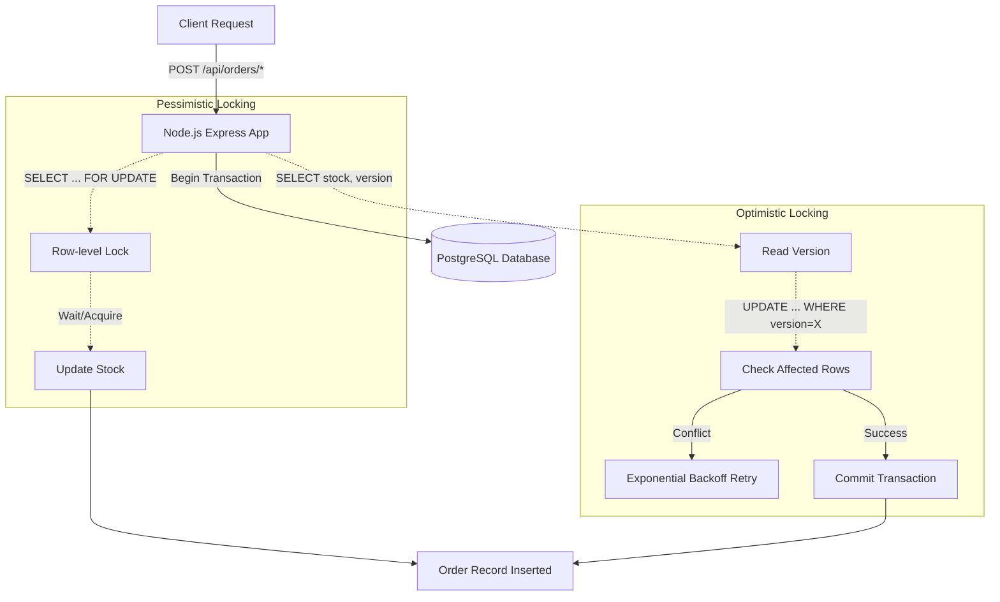

# Database Concurrency Control Simulator

This project is a complete containerized simulation of **pessimistic** and **optimistic** database locking strategies in the context of an e-commerce inventory management system. It showcases how to prevent data integrity issues like lost updates when placing orders concurrently.

## Architecture Diagram



## Project Structure

```text
/
├── app.js                 # Express application setup
├── db.js                  # PostgreSQL pool configuration
├── routes.js              # API endpoints containing locking logic
├── server.js              # Server entry point
├── Dockerfile             # Node application container definition
├── docker-compose.yml     # Orchestration of Node and DB containers
├── concurrent-test.sh     # Bash script to simulate load
├── monitor-locks.sh       # Bash script to view active DB locks
├── .env.example           # Example environment configurations
├── package.json           # Node project metadata and dependencies
├── seeds/                 # Initialization scripts
│   └── init.sql           # Database schema and mock data

```

## Prerequisites
- **Docker** and **Docker Compose** installed.
- **Node.js** (Only if you wish to run the app outside of Docker or run tests locally).

## How to Start the Application
1. Copy the `.env.example` file and rename it to `.env`:
   ```bash
   cp .env.example .env
   ```
2. Build and start the infrastructure via Docker Compose:
   ```bash
   docker-compose up -d --build
   ```
3. The API will be available at `http://localhost:8080`.

## Available Endpoints

- `POST /api/products/reset`: Resets inventory.
- `GET /api/products/:id`: Fetch specific product details.
- `POST /api/orders/pessimistic`: Process an order mimicking pessimistic locking.
- `POST /api/orders/optimistic`: Process an order mimicking optimistic locking with retries.
- `GET /api/orders/stats`: Evaluate the results of concurrency tests.

## How to Test

### Automated Tests (Jest)
To run the programmatic suite of checks confirming API behavior against out of stock conditions:
```bash
npm install
npm test
```

### Manual Concurrency Scripts
Make the bash scripts executable first:
```bash
chmod +x concurrent-test.sh monitor-locks.sh
```
1. **Pessimistic Check**:
   ```bash
   ./concurrent-test.sh pessimistic
   ```
   *Watch the terminal for active locks using `./monitor-locks.sh`.*
2. **Optimistic Check**:
   ```bash
   ./concurrent-test.sh optimistic
   ```
3. **Verify Stats**:
   Check how many requests failed due to contention vs out of stock.
   ```bash
   curl localhost:8080/api/orders/stats
   ```
